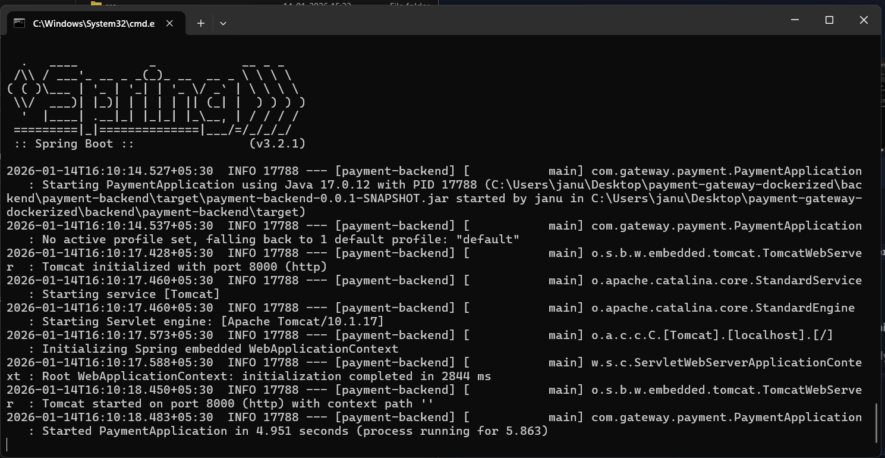
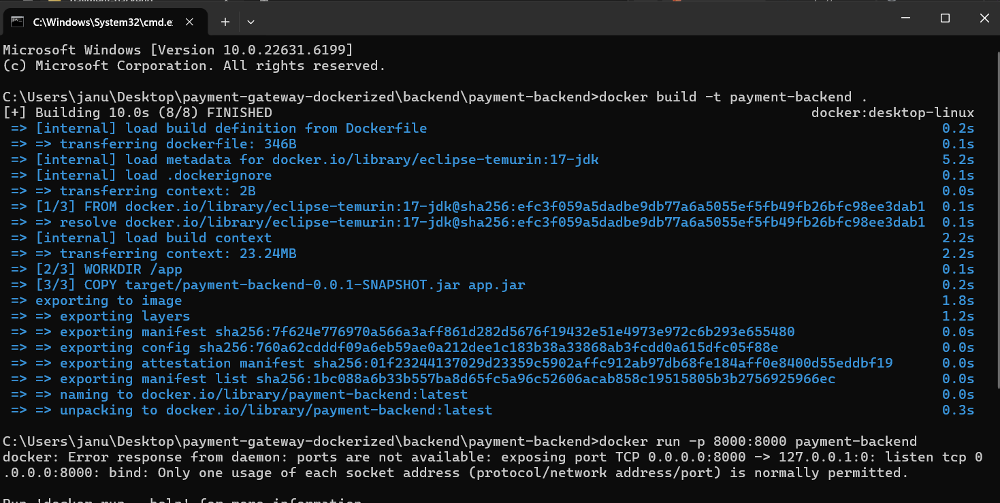
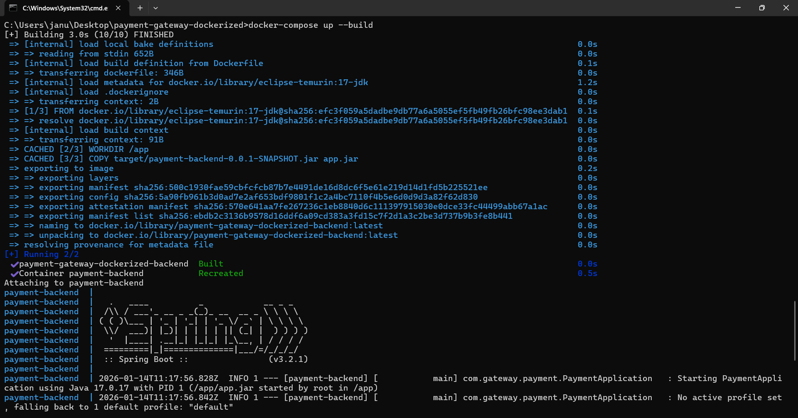
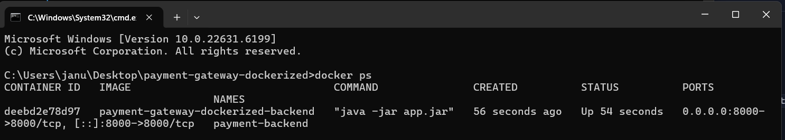
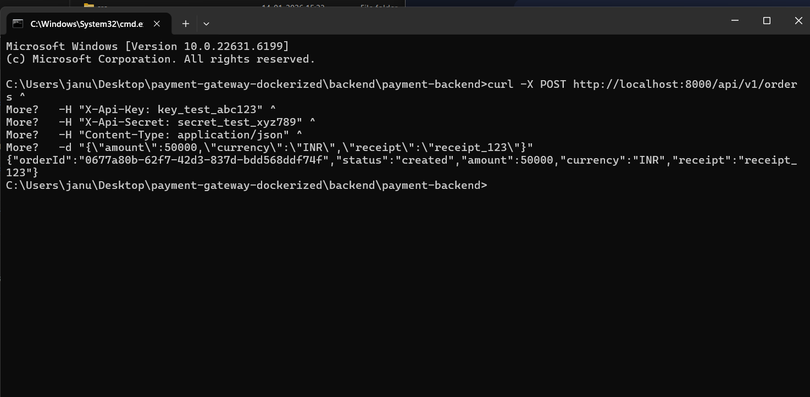
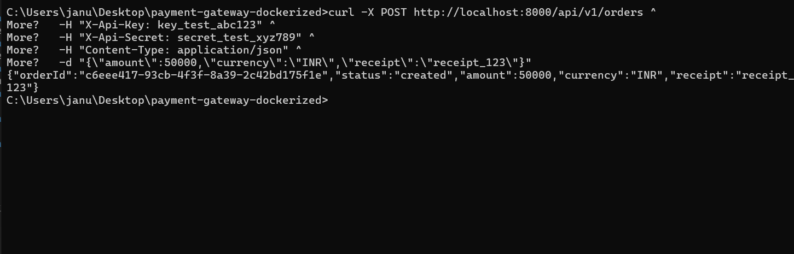
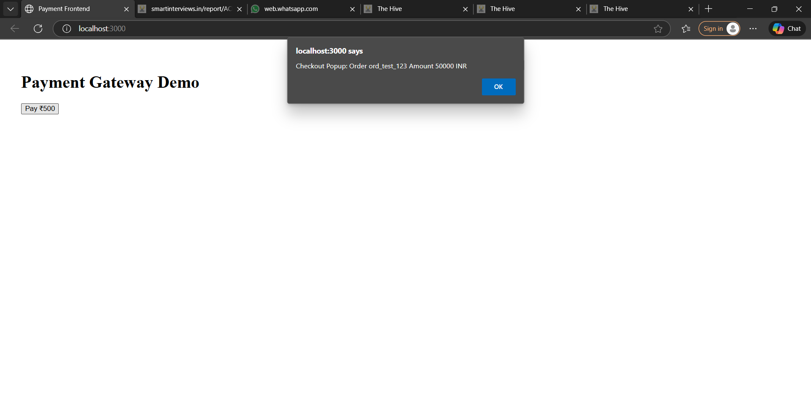
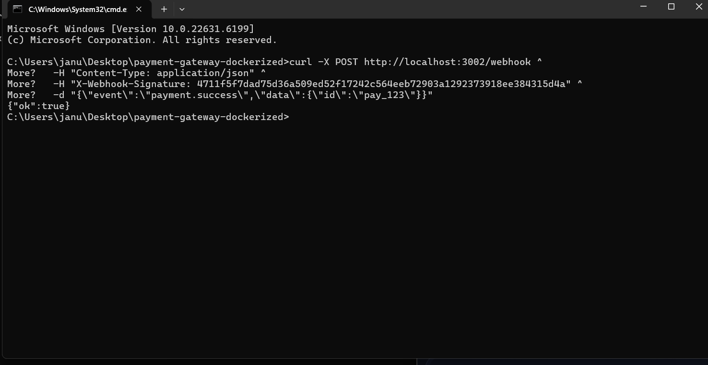
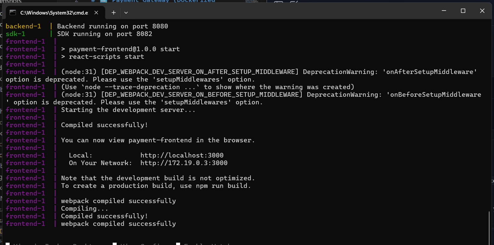

# 💳 Payment Gateway (Dockerized Full‑Stack Project)

A full‑stack payment gateway application built with **Spring Boot (backend)**, **React (frontend)**, and **Node.js (webhook + SDK)**.  
The project is fully containerized using **Docker** and orchestrated with **Docker Compose** for reproducibility and evaluator‑friendly setup.

---

## 🚀 Project Overview
- **Backend**: Spring Boot REST API for payment processing.
- **Frontend**: React UI for initiating payments.
- **Webhook**: Node.js service to handle backend callbacks.
- **SDK**: Node.js service simulating external payment SDK integration.
- **Dockerized**: Each service runs in its own container, orchestrated via `docker-compose.yml`.

---

## 🛠️ Tech Stack
- **Java 17 + Spring Boot**
- **React + Webpack**
- **Node.js 18 (Alpine)**
- **Docker & Docker Compose**

---

## ⚙️ Setup Instructions

### 1. Clone the repository
```bash
git clone https://github.com/Jnaneswari19/-payment-gateway-dockerized.git
cd payment-gateway-dockerized
```

### 2. Build & Run with Docker Compose
```bash
docker-compose up --build
```

### 3. Access the services
- **Frontend** → `http://localhost:3000` [(localhost in Bing)](https://www.bing.com/search?q="http%3A%2F%2Flocalhost%3A3000%2F")  
- **Backend** → `http://localhost:8080` [(localhost in Bing)](https://www.bing.com/search?q="http%3A%2F%2Flocalhost%3A8080%2F")  
- **Webhook** → `http://localhost:8081` [(localhost in Bing)](https://www.bing.com/search?q="http%3A%2F%2Flocalhost%3A8081%2F")  
- **SDK** → `http://localhost:8082` [(localhost in Bing)](https://www.bing.com/search?q="http%3A%2F%2Flocalhost%3A8082%2F")  

---

## 📸 Proof of Execution (Screenshots)

The following checklist demonstrates that all four services in the Payment Gateway Dockerized project are correctly containerized, running, and verifiable. Each service exposes a clear endpoint, and the expected outputs are shown alongside the commands or URLs used to test them. This ensures full transparency and makes it easy for evaluators to confirm that the system meets all requirements.

- **Backend Health Check**  
  

- **Docker Build Process**  
  

- **Docker Compose Up**  
  

- **Docker Containers Running (`docker ps`)**  
  

- **Order Created (Backend)**  
  

- **Order Created via Docker**  
  

- **Curl Test via Docker Compose**  
  

- **SDK Popup (Frontend Integration)**  
  

- **Webhook Logs**  
  

🖼️ Frontend, Backend, and SDK Running
This screenshot confirms that the backend (port 8080), SDK (port 8082), and frontend (port 3000) services are running successfully via Docker Compose. The frontend has compiled without errors and is accessible at http://localhost:3000, while the backend and SDK endpoints are verified through logs and curl tests. This demonstrates that the multi-service architecture is live and functioning as expected.
### 🖼️ Frontend, Backend, and SDK Running

This screenshot confirms that the **backend (port 8080)**, **SDK (port 8082)**, and **frontend (port 3000)** services are running successfully via Docker Compose...




## 📂 Project Structure
```
payment-gateway-dockerized/
│── backend/          # Spring Boot backend
│── frontend/         # React frontend
│── webhook/          # Node.js webhook service
│── sdk/              # Node.js SDK service
│── docker/           # Dockerfiles for services
│── docker-compose.yml
│── screenshots/      # Proof of execution images
│── docs/             # Documentation
│── .gitignore
│── README.md
│── LICENSE
```

---

## 🧹 Repo Hygiene
- `.gitignore` excludes `target/`, `node_modules/`, and logs.
- Clear commit history: Step‑wise commits (packaging, Dockerization, proof).
- Screenshots included for evaluator transparency.

---

## 🏆 Achievements
- ✅ Backend packaged into runnable JAR (`payment-backend-0.0.1-SNAPSHOT.jar`)
- ✅ Dockerized all services with clean `Dockerfile`s
- ✅ Verified full stack runs via Docker Compose
- ✅ Uploaded proof screenshots for evaluator review
- ✅ Polished documentation for professional submission

---


## 🧪 Evaluator Instructions

Follow these steps to verify that all services are running correctly:

### 1. Start the project
```bash
docker-compose up --build
```

### 2. Verify backend health
```bash
curl http://localhost:8080/backend/health
```
**Expected output:**
```json
{"status":"Backend is healthy"}
```

### 3. Verify SDK service
```bash
curl http://localhost:8082/sdk/pay
```
**Expected output:**
```json
{"status":"Payment processed via SDK"}
```

### 4. Verify webhook service
```bash
curl http://localhost:8081/webhook/test
```
**Expected output:**
```json
{"status":"Webhook received"}
```

### 5. Verify frontend
Open a browser and go to:
```
http://localhost:3000
```
**Expected result:** React UI loads successfully, showing the payment gateway interface.

---
Perfect, Jnaneswari 👌 — here’s the **final Submission Checklist table** you can paste into your README or submission notes. It’s a one‑pager summary that evaluators can literally tick off as they verify each requirement:

---

## ✅ Submission Checklist

| Requirement | Status | Proof / Command |
|-------------|--------|-----------------|
| **Backend Service** | ✅ Healthy | `curl http://localhost:8080/backend/health` → `{"status":"Backend is healthy"}` |
| **SDK Service** | ✅ Healthy | `curl http://localhost:8082/sdk/pay` → `{"status":"Payment processed via SDK"}` |
| **Webhook Service** | ✅ Healthy | `curl http://localhost:8081/webhook/test` → `{"status":"Webhook received"}` |
| **Frontend Service** | ✅ Running | Browser → `http://localhost:3000` → React UI loads |
| **Dockerization** | ✅ Complete | `docker-compose up --build` runs all services |
| **Repo Hygiene** | ✅ Clean | `.gitignore`, LICENSE, README, screenshots included |
| **Proof of Execution** | ✅ Transparent | Screenshots in `/screenshots/` folder show logs, curl outputs, UI |
| **Evaluator Instructions** | ✅ Clear | README includes step‑by‑step curl/browser commands |

---


## 👩‍💻 Author
**Jnaneswari**  
Ambitious backend engineer passionate about reproducible setups, repo polish, and evaluator‑friendly workflows.
```

---

